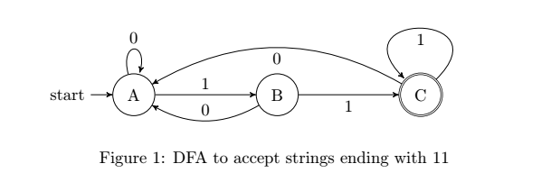
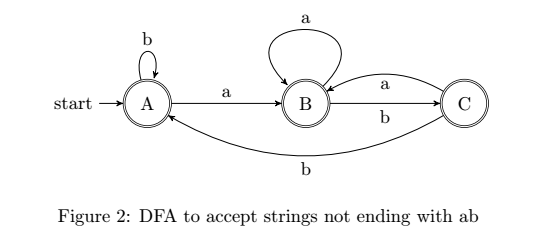
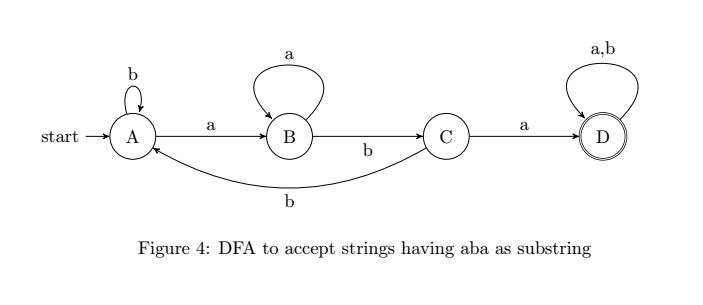
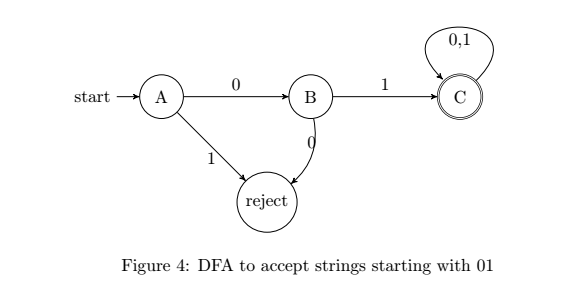
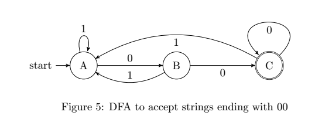
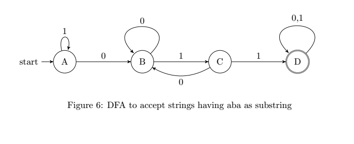

### Lab Assignment

#### DFA Lab

---

###### Question 1

Give the DFA for the language of string over {0,1} in which each string ends with $11$.

###### `<u>`Solution:`</u>`

###### State Diagram:

###### State Table:

| State/input | 0 | 1 |
| ----------- | - | - |
| A           | A | B |
| B           | A | C |
| C           | A | C |

###### State Function:

$\displaylines{\delta(A,0) \rightarrow A \\\ \delta(A,1) \rightarrow B \\\ \delta(B,0) \rightarrow A \\\ \delta(B,1) \rightarrow C \\\ \delta(C,0) \rightarrow A \\\ \delta(C,1) \rightarrow C \\\ }$

---

###### Question 2

Give the DFA accepting the string over {a,b} such that each string does not end with ab.

###### `<u>`Solution:`</u>`

###### State Diagram:

###### State Table:

| State/input | a | b |
| ----------- | - | - |
| A           | B | A |
| B           | B | C |
| C           | B | A |

###### State Function:

$\displaylines{ \delta(A,0)\rightarrow B \\\ \delta(A,1)\rightarrow A \\\ \delta(B,0)\rightarrow B \\\ \delta(B,1)\rightarrow C \\\ \delta(C,0)\rightarrow B \\\ \delta(C,1)\rightarrow A \\\ }$

---

###### Question 3

Give the DFA for the language of string over {a,b} such that each string contains aba as substring.

###### `<u>`Solution `</u>`

###### State Diagram:

###### State Table

| State/Input | a | b |
| ----------- | - | - |
| A           | B | A |
| B           | B | C |
| C           | D | A |
| D           | D | D |

###### State Function

$\displaylines{\delta(A,a) \rightarrow B \\\ \delta(A,b) \rightarrow A \\\ \delta(B,a) \rightarrow B \\\ \delta(B,b) \rightarrow C\\\ \delta(C,a) \rightarrow D \\\ \delta(C,b) \rightarrow A\\\ \delta(D,a) \rightarrow D \\\ \delta(D,b) \rightarrow D}$

---

###### Question 4

Give the DFA for the language of string over {0,1} such that each string start with 01.

###### `<u>`Solution `</u>`

###### State Figure

State Table

| State/Input | 0      | 1      |
| ----------- | ------ | ------ |
| A           | B      | reject |
| B           | reject | C      |
| C           | C      | C      |

###### State Function

$\displaylines{\delta(A,0) \rightarrow B \\\ \delta(A,1) \rightarrow Reject \\\ \delta(B,0) \rightarrow C \\\ \delta(B,1) \rightarrow Reject \\\ \delta(C,0) \rightarrow C \\\ \delta(C,1) \rightarrow C \\\ }$

---

###### Question 5

Give the DFA for the language of string over {0,1} such that the set of all string ending in 00.

###### `<u>`Solution `</u>`

###### State Diagram

###### State Table

| State/Input | 0 | 1 |
| ----------- | - | - |
| A           | B | A |
| B           | C | A |
| C           | C | A |

###### State Function

$\displaylines{\delta(A,0) \rightarrow B \\\ \delta(A,1) \rightarrow A \\\ \delta(B,0) \rightarrow C \\\ \delta(B,1) \rightarrow A \\\ \delta(C,0) \rightarrow C \\\ \delta(C,1) \rightarrow A \\\ }$

---

###### Question 6

Give the DFA for the language of string over {0,1} such that set of strings with 011 as a substring.

###### `<u>`Solution `</u>`

###### State Diagram

###### State Table

| State/Input | 0 | 1 |
| ----------- | - | - |
| A           | B | A |
| B           | B | C |
| C           | B | D |
| D           | D | D |

###### State Function

$\displaylines{\delta(A,0) \rightarrow B \\\ \delta(A,1) \rightarrow A \\\ \delta(B,0) \rightarrow B \\\ \delta(B,1) \rightarrow C \\\ \delta(C,0) \rightarrow B \\\ \delta(C,1) \rightarrow D \\\ \delta(D,0) \rightarrow D \\\ \delta(D,1) \rightarrow D \\\ $

---
